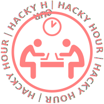

# About
Come and talk with your peers and colleagues about your research problems related to code, data or digital tools.
If you do have a specific problem - bring it along and get help.
You can also just take a break, come by and socialize.
No registration needed!
Every second week we cover a particular topic that might be of special interest to you, however prior knowledge is not a prerequisite.

# When and Where
Every Wednesday at 2pm at [Café Freundlich](https://www.openstreetmap.org/?mlat=52.3819&mlon=13.0650#map=16/52.3819/13.0650&layers=N), Telegrafenberg, House 34, 14473 Potsdam.

# Upcoming Topics

| Date       | Title | Discussion |
| ---------- |------ | ---------- |
| 2019-03-20 | Generic Talk - It is PhD Day | |
| 2019-03-27 | GIS scripting 4- doing GIS stuff in your code | |
| 2019-04-03 | Recap & General discussion | |

# Past Topics

| Date       | Title | Discussion |
| ---------- |------ | ---------- |
| 2019-01-09 | What is git and why should I use it | [pad](https://hackmd.io/1SqnbwuJQZaQsjSwOY1C0A) |
| 2019-01-16 | Recap & General discussion | [pad](https://hackmd.io/m9w6SE4cREyaTk0aDbYwTA) |
| 2019-01-23 | Sustainable programming or why I don't understand the code of my supervisor | [pad](https://hackmd.io/tflMMsAnQ367p32MVWwFYw) |
| 2019-01-30 | Recap & General discussion | [pad](https://hackmd.io/20RR1el4QwCjpYXllrqNOg) |
| 2019-02-06 | I have 8 CPU cores but my script uses only one | [pad](https://hackmd.io/_q3PO8slT8qvbVnn2yFLzg) |
| 2019-02-13 | Recap & General discussion | [pad](https://hackmd.io/3ZAf22APRg-8XEsBfA_6kw) |
| 2019-02-20 | Data visualization - Show your data and analysis results | |
| 2019-02-27 | Recap & General discussion | |
| 2019-03-06 | Markdown - somewhere between Latex and Word | |
| 2019-03-13 | Recap & General discussion | |

# Inspiration
This project is inspired by [HACKYHOUR@AUCKLAND](https://uoa-eresearch.github.io/HackyHour/) and the [R Study Group](http://minisciencegirl.github.io/studyGroup/).
If you are interested in the HackyHour you should also check out [WUBSyB](http://wubsyb.github.io/)

# Logo
The logo is derived from the one used by HackyHour Auckland (with kind permission).
It uses a modified public domain <a href="https://thenounproject.com/search/?q=hackathon&i=6324">icon</a>, the open <a href="https://fontlibrary.org/en/font/charis">Charis</a> font (SIL Open Font License).

# License
The content of this website is available under [CC0](LICENSE).
This website uses the [hacker template](https://github.com/pages-themes/hacker/) which is also available under [CC0](https://creativecommons.org/publicdomain/zero/1.0/legalcode).
